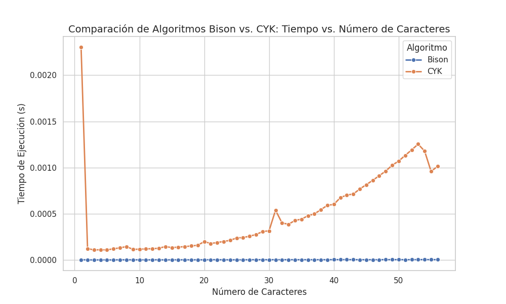

# Comparación entre el Algoritmo CYK y Bison

## 1️⃣ Introducción
En este informe se analizan las diferencias entre el **algoritmo CYK** (Cocke-Younger-Kasami) y el **algoritmo basado en Bison**, comparando su eficiencia en términos de tiempo de ejecución y consumo de memoria. 

## 2️⃣ Descripción de los Algoritmos

### 🔹 Algoritmo CYK
El algoritmo **CYK** es un método de análisis sintáctico utilizado para determinar si una cadena pertenece a un lenguaje generado por una **gramática libre de contexto en forma normal de Chomsky (CNF)**. Su principal característica es que **siempre garantiza encontrar la derivación más corta**.

📌 **Características principales:**
- **Complejidad:** \(O(n^3)\), donde \(n\) es la longitud de la cadena.
- **Uso:** Se emplea principalmente en **teoría de lenguajes y compiladores**.
- **Método:** Utiliza **programación dinámica** para construir una tabla de subproblemas y determinar si una cadena es válida.

---

### 🔹 Algoritmo basado en Bison
Bison es un **generador de analizadores sintácticos** que convierte una gramática en un **parser descendente tipo LR (Left-to-Right, Rightmost derivation)**. En nuestro caso, se usa para procesar cadenas de **'a' y 'b'** en función de reglas definidas en **Yacc/Bison**.

📌 **Características principales:**
- **Complejidad:** \(O(n)\) en el mejor caso y **más eficiente que CYK** en la mayoría de los casos prácticos.
- **Uso:** Es ampliamente utilizado en **compiladores reales y herramientas de análisis sintáctico**.
- **Método:** Genera un parser basado en **pilas y autómatas LR**, lo que permite un análisis eficiente de gramáticas más grandes.

---

## 3️⃣ Comparación de Rendimiento

| Métrica | Algoritmo CYK | Algoritmo Bison |
|---------|--------------|----------------|
| **Tiempo de Ejecución** | \(O(n^3)\) | \(O(n)\) (para gramáticas LR) |
| **Consumo de Memoria** | Alto (usa una tabla \(n \times n\)) | Bajo (usa pilas y estados) |
| **Versatilidad** | Solo funciona con gramáticas en **CNF** | Compatible con muchas gramáticas |
| **Aplicaciones** | Análisis formal de lenguajes | Compiladores y procesamiento de lenguajes reales |

---

## 📊 Comparación Gráfica

A continuación, se muestra una gráfica comparativa de los tiempos de ejecución de ambos algoritmos:

## 4️⃣ Conclusiones
- **Bison** es más eficiente que **CYK** en términos de **tiempo y memoria**, ya que CYK tiene una complejidad **cúbica** mientras que Bison es casi **lineal** en muchos casos.
- **CYK** es útil en **lingüística computacional y verificación de gramáticas** en **CNF**, pero no es práctico para compiladores.
- **Bison** es más **adecuado para la implementación real de compiladores**, mientras que CYK es más **teórico**.

---
